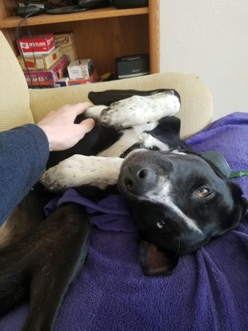

[Now pages](https://www.nownownow.com) are so hip right now. Here's what I'm up to, as of **February 26, 2021**.

**Home:** In Boulder, CO with my fiancée, Jill.

**Work:** I work at Google as a software engineer, writing libraries used for testing the firmware of ChromeOS.

**Alphabet Workers Union:** On January 4, 2021, a few hundred Alphabet employees in the U.S. and Canada announced that they were forming a union. I was among them.

**Meditation:** I've been struggling for several months to uphold a daily practice, despite my sangha's vast opportunities for online practice via Zoom. I'm using Headspace to make it a little easier.

**Dog:** In August 2020, Jill and I got a puppy. Her name is Omelet and she is a handful. Nevertheless, we love her. Someday we aspire to go hiking off-leash together. But not yet. Here's a pic of her being a cutie:

**Media Consumption:** I'm reading too many books right now: 

* _Atomic Habits_ (James Clear)
* _How to Be an Anti-Racist_ (Ibram X. Kendi)
* _Brotopia_ (Emily Chang)
* _Why Buddhism is True_ (Robert Wright)
* _The Name of the Wind_ (Patrick Rothfuss)
* _No Shortcuts_ (Jane McAlevey)

For TV (well, streaming), I'm watching _WandaVision_, and it's amazing. Jill and I are also watching _Only Connect_ (Series 16).

For podcasts, I'm not especially religious about any of these, but these are the ones I tend to listen to:

* ReplyAll
* Comedy Bang Bang
* Your Undivided Attention
* How to Save a Planet
* The Adventure Zone, occasionally
