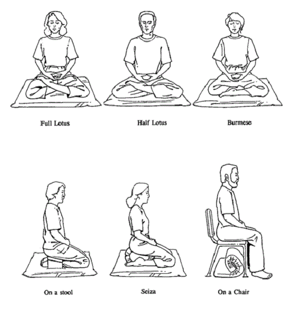

I have met a lot of people who want to start meditating, or who have tried but it “didn’t work” for them. All the self-help articles and magazine covers at Sprouts, and now even western science, say it’s supes important. But like any healthy habit, it can be hard to get started. Maybe even harder than most healthy habits, because they teach you in school how to run and to floss, but not how to meditate.

Meditation is my most important practice, personally. It keeps me sane and helpful. When I’m meditating regularly, my thoughts, words, and actions are aligned with what I really want. When I’m not meditating regularly, I feel overwhelmed, reactive, and cheated by life, and I become a jerk.

If you’re looking to start a meditation practice, I hope that I can offer a little help.

## Different Styles of Meditation

There are gazillions of ways to meditate. If you ask ten meditators how to meditate, you’ll get twelve conflicting answers. Many paths, same mountain.

The guidance I’m offering comes from my practice with Zen Buddhism. I started meditating in 2015, then sat mostly alone in my bedroom until 2018, when I found Zen. I’m going to offer guidance that’s aligned with Zen, because that’s what I know best.

## Two Minutes Every Day

A Zen roshi in Boston once told me, “Two minutes of zazen every day is more beneficial than one hour every week.”

Here’s what I recommend. Dedicate a specific time to meditating every day. I recommend first thing upon getting out of bed, before coffee. I know your morning is busy, but I also know you can set your alarm two minutes earlier.

Some people prefer to meditate at night. That’s fine too. But I recommend not doing it right after a large meal, nor last thing before bed. Both of those will make you sleepier. That said, I would rather meditate right before bed than not at all.

What you’re trying to build is **consistency**. The only way to “succeed” at meditating is by doing it consistently. If you can sit still for 2 minutes every morning for a week, that’s an accomplishment. For a month, even better.

## How to Sit

Yeah, we’re going to talk about the mechanics of how to sit.

You can skip this section if you want. There’s no “required” way to sit. But these guidelines make it easier to maintain your concentration. Some folks’ guidance is much more particular than mine, but this is a beginner’s guide, so let’s keep it simple.

I like to sit on a cushion on the floor. Some people prefer to sit in a chair. Either is fine. Either way, I advise you not to lean against anything, lest you fall asleep. Your spine should keep you erect. Your ears should be stacked over your shoulders, and your shoulders over your hips. It should be like there’s a string pulling the top of your head upward.

Next, your legs. If you’re sitting in a chair, put your feet flat on the ground. Easy! If you’re sitting on a cushion, the two common positions are cross-legged and seiza (shins straight back so your feet are next to your butt). You don’t have to cross your legs like they do on TV.

Check it out, someone else made a diagram. Thanks, internet!

Next, hands. Some people get real woo-woo about hand position. The simplest thing is to rest your hands on your knees. I like to rest my left hand over my right, thumbnails touching, resting in the middle of my lap. Like in the diagram above! The main idea is to avoid fidgeting.

Finally, your eyes. Some folks recommend keeping your eyes open, lest you fall asleep. Some folks recommend keeping your eyes closed, lest you get distracted. The guidance I learned was 80% closed, gazing downward, unfocused. Do what works for you.

That’s it. Now you’re sitting. Good job. Do that for 2 minutes and you’ve meditated, sorta.

## Breath Counting

Meditation is all about attention.

I recommend a practice called “counting the breath.” When you’ve sat down for meditation, set a timer for 2 minutes, and begin. Count your exhales, from one to ten. Hear the count for the entire length of the exhale. Inhale… ooooooooooone… inhale… twooooooooooo… inhale… threeeeeee… etc. When you reach ten, start back at one. When you lose count, that’s fine. Start back at one. When the timer goes off, good job. You did it.

Note that I said “when” you lose count, not “if.” You’re going to lose count a lot. Everyone does, even skilled meditators. In fact, you can congratulate yourself for noticing that your attention drifted. Usually we go all day without noticing our thoughts. That’s what we’re here to do.

Don’t try to stop your thoughts. Your brain will continue to think, whether you like it or not. That’s what brains do. All you need to do is notice when your attention has drifted, and gently return to counting your breaths.

That’s it. That’s how you meditate.

## Next Steps

When 2 minutes feels good to you, congratulate yourself. That’s a big step.

You can set a longer timer. Try 3 minutes. Then 5 minutes. Maybe 10. If 10 minutes is too much, go back to 6 minutes. It’s your practice, and it’s not a race. These days I like 25 minutes.

If you’re able to count to 10 consistently, maybe try dropping the count, and instead return your attention to feeling your breath with your whole body. This practice is called “following the breath”.

If you want to deepen your practice, I strongly recommend meditating with a group. In Boulder, I would be thrilled if you would join me at the [Eon Zen Center](http://www.eonzen.org). There are thousands of practice groups across the world, and not all are affiliated with Buddhism. All would be glad to have you.

I really like the app [Headspace](https://www.headspace.com/). It has hundreds of guided meditations themed around different goals. If you work at Google, you can get a free subscription at go/headspace.

If you want a comfortable cushion to sit on, you might buy a [zafu](https://en.wikipedia.org/wiki/Zafu), and possibly a [zabuton](https://en.wikipedia.org/wiki/Zabuton). If you prefer to sit seiza, you might buy a [seiza bench](https://external-content.duckduckgo.com/iu/?u=https%3A%2F%2Fdigitalambler.files.wordpress.com%2F2011%2F06%2Fimg_0039.jpg).

Also, this really isn’t important, but for my meditation timer I like the app “Insight Timer.”

Finally, hit me up. I would love to hear how it’s going. Seriously, if you just started your practice, or if it’s going well or poorly, or if you’re having trouble with consistency, I’d love to talk.

